# 🌬️ Apache Airflow 정리

Airflow는 **워크플로우 오케스트레이션 도구**로, 작업(Task) 간의 관계와 실행 흐름을 **DAG(Directed Acyclic Graph)** 형태로 정의하여 데이터 파이프라인을 관리함

---

## 🧠 Core Concepts
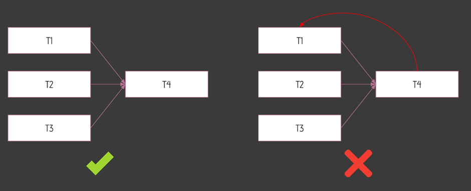
### 📌 DAG (Directed Acyclic Graph)
- **방향성이 있는 비순환 그래프**
- 작업 간의 **관계와 종속성**을 정의
- **사이클이 존재하지 않아야 함** → 무한 루프 방지
- 비동기성, 병렬 처리 지원

> 🧩 예시: `T4`는 `T1`에 의존하지만, `T1`도 `T4`에 의존하게 되면 사이클 발생 → DAG에서는 불가능

---

### 📌 Operator
- 개별 작업 단위를 정의하는 **"명령 블록"**
- DAG가 레시피라면, Operator는 조리 과정 한 단계
- 종류:
  - `PythonOperator`, `BashOperator`, `PostgresOperator`
  - `HttpSensor`, `FileSensor` 등
- `Providers`를 통해 외부 시스템과 연동 가능

---

### 📌 Task / Task Instance
- `Task`: Operator가 DAG 내에 정의된 상태
- `Task Instance`: 특정 시점에 실제로 실행되는 Task (시간 정보 포함)

> 예: “5개의 달걀을 깬다”가 `Task`, “2시에 5개의 달걀을 깼다”가 `Task Instance`

---

### 📌 Workflow
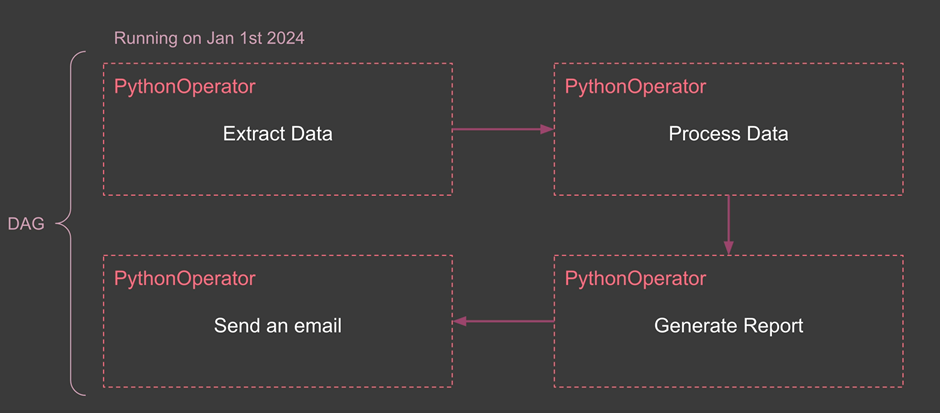
- DAG가 정의하는 **전체 데이터 파이프라인**
- 모든 Task와 그 사이의 종속성 포함
- 예: 일일 판매 보고서
  - 1. 데이터 추출
  - 2. 전처리
  - 3. 보고서 생성
  - 4. 이메일 발송


- 실행되는 순간 TASK는 TASk INSTANCE가 됨
- 실행되기 전까지는 Extract_Data라는 Task형태로 존재
---

## ❌ Airflow가 아닌 것들

| ❌ 항목 | 설명 |
|--------|------|
| 데이터 처리 프레임워크 | 자체적으로 대용량 데이터를 처리하지 않음 (Spark 같은 외부 도구 사용) |
| 실시간 스트리밍 시스템 | 실시간 처리 불가, **배치 기반 처리에 적합** |
| 데이터 저장 시스템 | 자체적으로 데이터 저장하지 않음. **메타데이터용 DB만 사용** |

---

## ⚠️ 적합하지 않은 사용 사례

1. **초고빈도 스케줄링 (Sub-minute)**  
2. **수 TB 이상 대용량 직접 처리**  
3. **실시간 데이터 스트리밍 처리**  
4. **매우 단순한 선형 워크플로우**

---

## ⚙️ Airflow 구성 아키텍처

### 🖥️ Single Node (단일 노드)
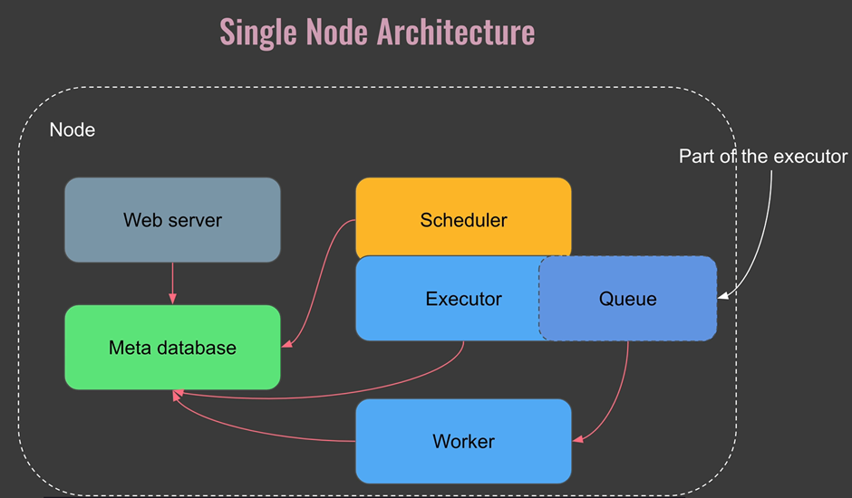
- 모든 구성요소가 **한 머신**에서 실행
- 구성 요소:
  - Webserver
  - Scheduler
  - Worker
  - Metadata DB (예: SQLite)
- 소규모 워크플로우에 적합, 간편한 설정

---

### 🖧 Multi Node (다중 노드)
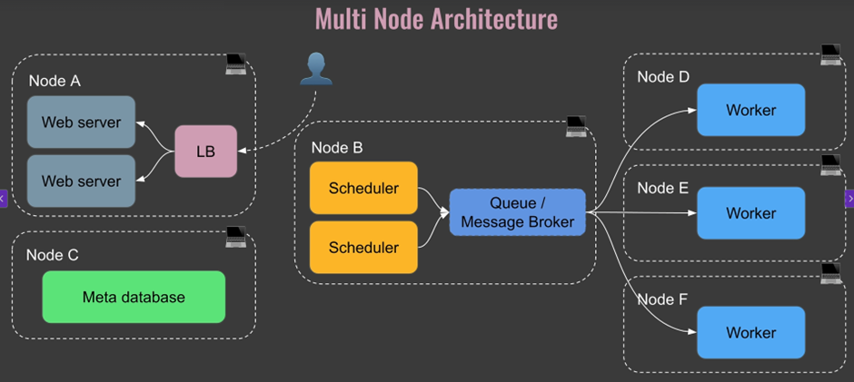
- 구성 요소들이 **여러 서버에 분산**
- Load Balancer, Redis, PostgreSQL, 다중 Scheduler 사용 가능
- 구성:
  - Webserver (Load Balanced)
  - Scheduler + Executor
  - Worker
  - Queue (Redis, RabbitMQ)
  - Meta DB (Postgres 추천)
- 확장성과 안정성 우수, 대규모 워크플로우에 적합

---

## 🌀 DAG 작동 흐름

1. DAG 파일이 DAG 폴더에 추가됨
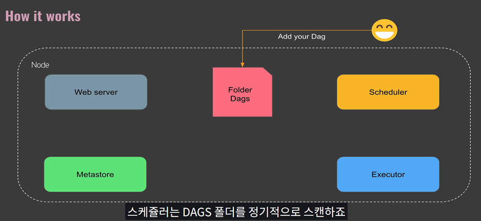
2. Scheduler가 DAG를 감지하고, `DagRun` 인스턴스 생성
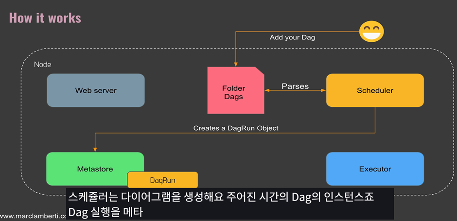
3. Task Instance를 생성하여 실행 준비
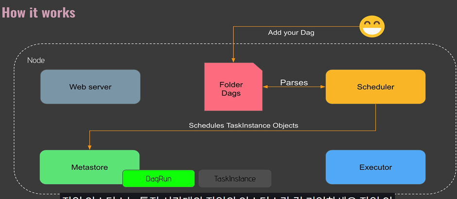
4. Scheduler → Executor → Queue 전달
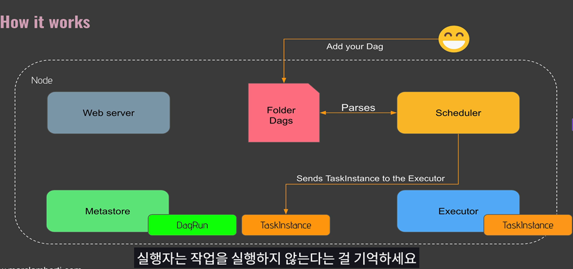
5. Worker가 Queue에서 작업을 가져와 실행
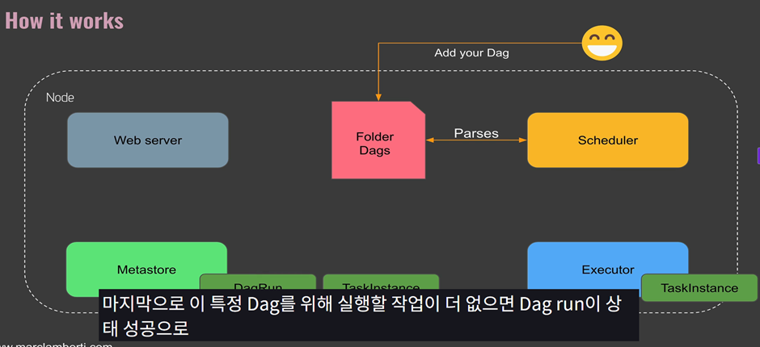
6. Meta DB에 상태 업데이트

---

## 🔧 주요 컴포넌트 요약

| 구성 요소 | 역할 |
|-----------|------|
| Webserver | UI 제공 |
| Scheduler | DAG 실행 스케줄 관리 |
| Executor | 어떤 방식으로 실행할지 정의 (로컬/셀러리 등) |
| Worker | 실제 Task 실행 |
| Meta DB | 모든 DAG/Task 상태 기록 (Postgres 추천) |
| Queue | Task를 전달하는 중간 버퍼 (Redis/RabbitMQ 등) |

---

## 🛠️ Operator 분류
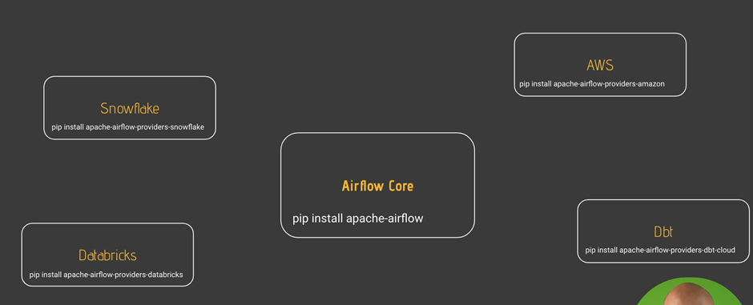
- **Action Operators**: 실제 동작 수행 (`PythonOperator`, `BashOperator`)
- **Transfer Operators**: 데이터 이동 (`S3ToGCSOperator` 등)
- **Sensors**: 특정 조건 충족 전까지 대기 (`HttpSensor`, `FileSensor`)


> 하나의 Operator에 여러 작업을 넣지 말 것. 재실행과 의존성 관리가 어렵기 때문!
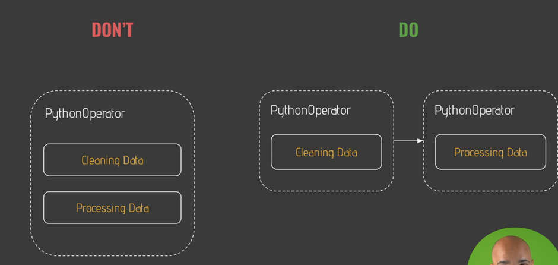
---

## 📦 Docker에서 Airflow 구성
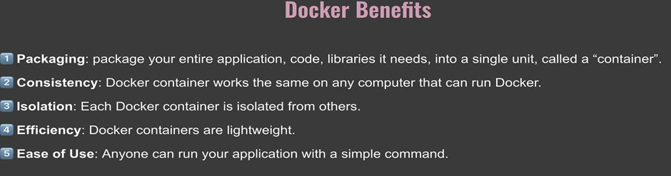
```bash
docker-compose up -d
docker-compose ps
docker exec -it airflow-airflow-scheduler-1 /bin/bash
airflow tasks test user_processing create_table 2023-01-01
```


## 🧩 추가 컴포넌트

- Sensor: 조건이 만족될 때까지 대기하는 Task (ex. API 응답 대기)

- Hook: 외부 시스템(DB, API 등)과 상호작용하는 연결 모듈 (권한 포함)

- Executor: Task 실행 방식 정의 (Local, Celery, Kubernetes 등)